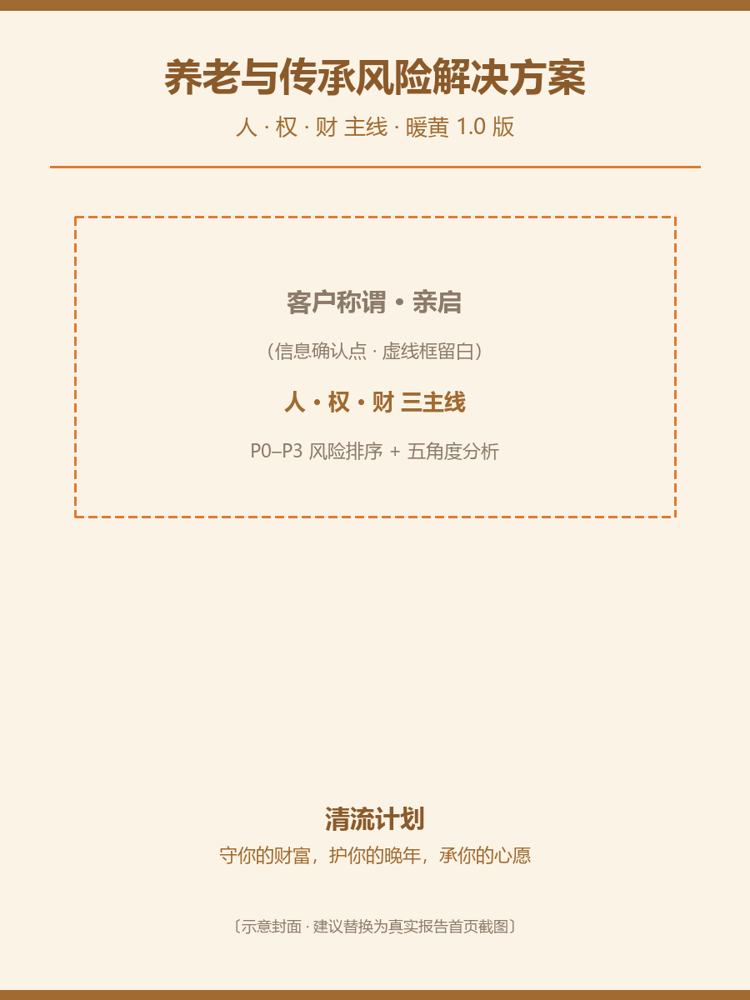

# hky-insure-solution · 养老与传承标准化解决方案

读取「风险评估报告」+「二次沟通记录」，把风险映射为可落地方案。只给工具类别与配置逻辑，不推具体产品。

## 依赖
零第三方依赖（仅 Python 标准库，直接构造 OOXML）。

## 内置生成器
`assets/solution_template.py`：把顶部 `DATA` 字典替换为本客户内容，`python solution_template.py` 即产出 `.docx`。

## 安装
把本目录整体复制到 WorkBuddy 用户技能目录（Windows）：
```
copy /Y * %USERPROFILE%\.workbuddy\skills\hky-insure-solution\
```
或在 WorkBuddy 中安装本包。

## 用法（复制给 WorkBuddy 的指令）
请用养老与传承标准化解决方案生成 Skill，读取下面的「风险评估报告」+「二次沟通记录」，产出标准版解决方案（人·权·财 主线，暖黄 1.0 版 docx）。方案只给工具类别+配置逻辑+参数化金额拆分，不推具体产品/品牌。

{粘贴风险评估报告 + 二次沟通记录}

## Demo
见 `demo/示例-养老与传承风险解决方案.docx`

## 效果示例


> 上图为封面示意。真实渲染见 `demo/示例-养老与传承风险解决方案.docx`（用 Word / WPS 打开导出首页截图即可替换本图）。

## 服务链（hky 三件套）
本技能是「养老与传承顾问三件套」的**下游**：

1. [hky-meeting-notes](https://github.com/hukaiyi777/hky-meeting-notes) — 客户沟通 → 结构化会谈纪要（上游）
2. [hky-insure-risk-report](https://github.com/hukaiyi777/hky-insure-risk-report) — 纪要 → 暖黄版风险评估报告（中游）
3. **hky-insure-solution（本仓库）** — 报告 + 二次沟通 → 可落地解决方案

> 三件套彼此独立、可分别安装，建议按 1→2→3 顺序串联使用。

品牌：清流计划 · 胡开奕（MIT 许可）
